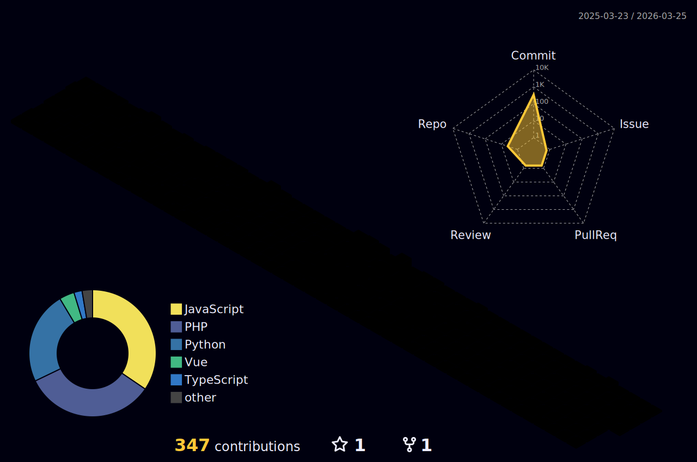

<!-- 🎉 입체적인 인삿말: Typing 애니메이션 -->
<h1 align="center">
  
</h1>

<!-- 🌐 3D GitHub Contribution Graph -->

  

<!-- 🛠️ Tech Stack Badges -->
<h3 align="center">💻 Tech Stack</h3>

  
  
  
  
  
  

<!-- 📊 GitHub 활동 Summary -->

  

  
  

<!-- 📫 Contact (선택 사항) -->

  

