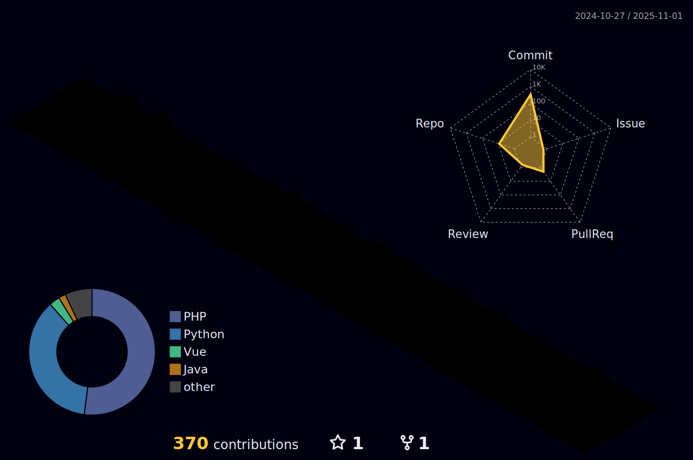

<!-- 🔥 입체감 있는 헤더 with Typing -->

  

 

<!-- 🧱 3D GitHub Contribution Graph -->

  

 

<!-- Tech Stack (카드형 뱃지) -->
<h2 align="center">Tech Stack</h2>

  
  
  
  
  
  

 

<!-- Contact -->
<h2 align="center">Contact</h2>

  

